<picture><source media="(prefers-color-scheme: dark)" srcset="assets/banner-dark.svg"></picture>

  <a href="https://nrvna.ai"><picture><source media="(prefers-color-scheme: dark)" srcset="assets/link-nrvna-dark.svg"></picture></a>
  &nbsp;
  <a href="https://x.com/nishgite"><picture><source media="(prefers-color-scheme: dark)" srcset="assets/link-x-dark.svg"></picture></a>
  &nbsp;
  <a href="https://www.linkedin.com/in/nishank-gite-997b13132/"><picture><source media="(prefers-color-scheme: dark)" srcset="assets/link-linkedin-dark.svg"></picture></a>

<picture><source media="(prefers-color-scheme: dark)" srcset="assets/divider-dark.svg"></picture>

### Now

**Co-Founder, [Nirvana Robotics](https://nrvna.ai)** · New York City

Building humanoids and general intelligence from the ground up.

### Before

- **University of Cambridge** · Mathematics
- **UC Berkeley** · Physics and Computer Science
- **Princeton** · differentiable algorithms and statistical theory
- **Lawrence Berkeley National Lab** · training and evaluating foundation models
- **SLAC National Accelerator Laboratory** · architecting foundation models for dark-matter searches
- **CERN** · training foundation models for Higgs boson analysis
